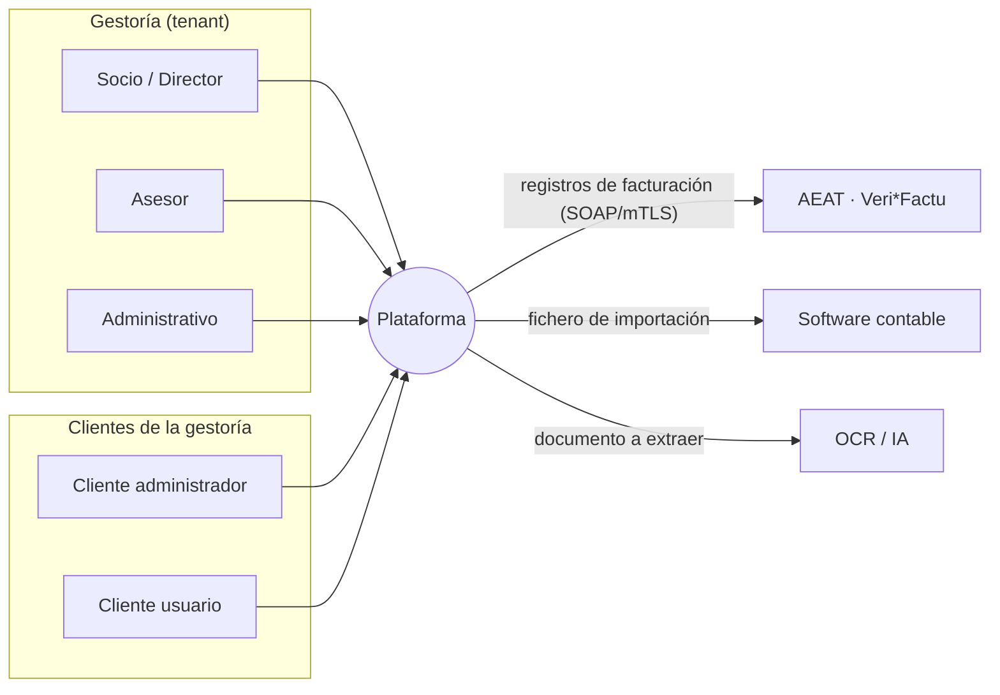
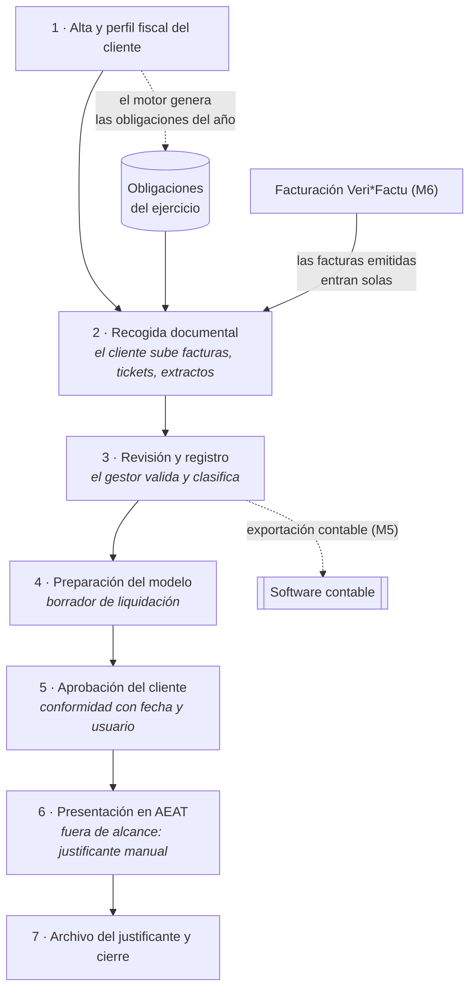
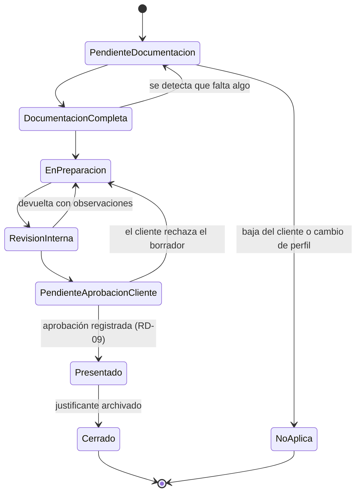

# 01 · Mapa de dominio

> **Estado:** vigente · **Versión:** 1.0 · **Fecha:** 2026-09-22
> Documento de referencia del lenguaje del proyecto. Todo el código, la base de datos y la interfaz usan **estos** nombres y no sinónimos.

---

## 1. Actores

### 1.1 Dentro de la gestoría (el tenant)

| Actor | Rol técnico | Qué hace | Qué NO puede hacer |
|---|---|---|---|
| **Socio / Director** | `SocioDirector` | Cuadro de mando, carga de trabajo, riesgo de vencimientos, rentabilidad por cliente. Alta y baja de usuarios y clientes | — (es el rol máximo del tenant) |
| **Asesor / Gestor** | `Asesor` | Revisa documentación, prepara modelos, mueve tarjetas en el Kanban, habla con el cliente, emite facturas en su nombre | Gestionar usuarios, ver datos de clientes que no tiene asignados *(configurable: ver §5, regla RD-07)* |
| **Administrativo** | `Administrativo` | Registra documentos, reclama documentación, archiva justificantes | Aprobar revisiones internas, marcar una obligación como presentada |

### 1.2 Del lado del cliente

| Actor | Rol técnico | Qué hace |
|---|---|---|
| **Cliente – administrador** | `ClienteAdmin` | Sube documentos, **aprueba borradores de impuestos**, emite facturas, consulta su calendario, gestiona los usuarios de su empresa |
| **Cliente – usuario** | `ClienteUsuario` | Sube tickets y facturas; emite facturas solo si se le concede el permiso |

### 1.3 Sistemas externos

| Sistema | Rol | Interfaz |
|---|---|---|
| **AEAT** | Recibe los registros de facturación Veri\*Factu | `IClienteAeatVerifactu` (SOAP + mTLS; simulador en la demo) |
| **Software contable** (A3, Sage, ContaPlus…) | Importa los asientos/facturas que exportamos | `IExportadorContable` (fichero, no API) |
| **Proveedor de OCR/IA** | Extrae datos de facturas escaneadas | `IExtractorDocumental` (simulado en la demo) |
| **Correo / SMS** | Avisos y reclamaciones | `INotificador` (bandeja en pantalla en la demo) |

> **Nota de diseño:** los cuatro sistemas externos entran **siempre** por un puerto (interfaz del dominio) y salen por un adaptador en `GestorFlow.Infraestructura` o `GestorFlow.Verifactu`. Nada del dominio conoce SOAP, HTTP ni ficheros.

### 1.4 Diagrama de contexto

---

## 2. Tipología de clientes

El **tipo de cliente** y su **perfil fiscal** son los datos que determinan qué obligaciones tiene. Es la pieza que hay que entender antes que ninguna otra.

| Tipo | Qué es | Obligaciones típicas |
|---|---|---|
| **Autónomo en estimación directa** (normal o simplificada) | Persona física con actividad económica que tributa por su beneficio real | 303 (IVA trimestral), 130 (pago a cuenta de IRPF), 111 y 115 si procede, resúmenes anuales, Renta |
| **Autónomo en estimación objetiva ("módulos")** | Persona física que tributa por unos índices fijos (metros, empleados…) en vez de por su beneficio real | **131** en lugar de 130; IVA posiblemente en régimen simplificado |
| **Sociedad (SL / SA)** | Persona jurídica | 303, 111, 115, 123, 202 (pagos a cuenta de Sociedades), 200 (Impuesto sobre Sociedades), cuentas anuales y legalización de libros en el Registro Mercantil |
| **Comunidad de bienes / entidad en atribución de rentas** | Varias personas que comparten una actividad sin crear una sociedad | IVA, **184** informativo, reparto de rendimientos a los comuneros |
| **Particular** | Persona física sin actividad | Renta (100) y, si procede, Patrimonio (714) |

### 2.1 Atributos del perfil fiscal que **alteran** las obligaciones

Estos son los interruptores que come el motor de reglas (§4):

| Atributo | Valores | Efecto típico |
|---|---|---|
| `FormaJuridica` | Autónomo, SL, SA, CB, Particular… | Base de todo el cuadro anterior |
| `RegimenIrpf` | Estimación directa normal / directa simplificada / objetiva (módulos) / no aplica | 130 vs **131** |
| `RegimenIva` | General, recargo de equivalencia, simplificado, criterio de caja, exento | Puede suprimir el 303 o cambiar su contenido |
| `PeriodicidadIva` | Trimestral / **mensual** | Inscripción en **REDEME** o en **SII** ⇒ 303 mensual |
| `TieneEmpleados` | sí/no | Activa 111 + 190 |
| `PagaProfesionalesConRetencion` | sí/no | Activa 111 + 190 |
| `AlquilaLocal` | sí/no | Activa 115 + 180 |
| `RepartePagosCapitalMobiliario` | sí/no | Activa 123 + 193 |
| `OperacionesIntracomunitarias` | sí/no | Activa **349** (mensual o trimestral) |
| `SuperaUmbral347` | sí/no (> 3.005,06 €) | Activa **347** en febrero |
| `Territorio` | Común / Foral (País Vasco, Navarra) | **Foral queda fuera del alcance**: otro sistema y otro calendario; además queda fuera de Veri\*Factu (p. ej. TicketBAI) `[VERIFICAR]` |
| `FechaCierreEjercicio` | normalmente 31-dic | Desplaza los plazos del 200 y de las cuentas anuales |
| `FechaAlta` / `FechaBaja` | fechas | Una obligación solo se genera para periodos en los que el cliente estaba de alta |

> **REGLA DE DISEÑO CLAVE — RD-01.** Las obligaciones de un cliente **no se dan de alta a mano**. Se **derivan** del perfil fiscal mediante un motor de reglas configurable **como datos, no como código**. Añadir un modelo nuevo o cambiar un plazo debe ser insertar filas, nunca desplegar binarios.

---

## 3. El ciclo de trabajo

Es lo que la plataforma digitaliza. Cada paso corresponde a un estado del Kanban (M4).

**Lectura comercial del diagrama:** el paso 2 es donde una gestoría pierde la mayor parte de su tiempo, y el módulo de facturación (M6) lo **elimina para las facturas emitidas**: si el cliente factura dentro de la plataforma, esas facturas ya están dentro y no hay nada que reclamar. Esa es la razón por la que M6 no es solo cumplimiento normativo, sino la palanca del producto.

### 3.1 Correspondencia con los estados del Kanban

| Paso del ciclo | Columna del Kanban (configurable) |
|---|---|
| 2 | `Pendiente documentación` → `Documentación completa` |
| 3–4 | `En preparación` |
| 4 | `Revisión interna` |
| 5 | `Pendiente aprobación cliente` |
| 6 | `Presentado` |
| 7 | `Cerrado (justificante archivado)` |

---

## 4. Conceptos del dominio

Los nombres de esta sección son **los definitivos**. El modelo de datos detallado vive en [04-modelo-datos.md](04-modelo-datos.md).

### 4.1 Núcleo

- **Gestoría (tenant).** Unidad de aislamiento. *Todo* dato del sistema pertenece a una gestoría, excepto el catálogo normativo (§4.4).
- **Cliente.** La empresa, autónomo o particular al que la gestoría presta servicio. No confundir con *usuario*.
- **Usuario.** Persona que entra en la plataforma. Pertenece a una gestoría y, si es del lado cliente, además a un cliente.
- **Asesor responsable.** Usuario de la gestoría asignado a un cliente. Base del reparto de carga de trabajo.

### 4.2 Fiscal

- **Modelo tributario.** Catálogo: 303, 130, 111… Con su periodicidad, a quién aplica y sus plazos por ejercicio.
- **Periodo.** `1T | 2T | 3T | 4T | 01..12 | Anual`, siempre dentro de un **ejercicio**.
- **Obligación.** *(entidad central)* La tupla `Cliente × Modelo × Ejercicio × Periodo`, con su estado, su asesor, sus dos fechas límite y su historial. **Una tarjeta del Kanban es una obligación**: no son entidades distintas. Ejemplo: *"303 · 3T 2026 · Panadería López SL"*.
- **Dos fechas límite por obligación** (RD-02): `FechaLimiteDomiciliacion` (si se paga por domiciliación bancaria el plazo cierra antes, ≈ día 15 `[VERIFICAR]`) y `FechaLimitePresentacion`. **El semáforo del Kanban se calcula sobre la de domiciliación**, que es la que de verdad aprieta.
- **Traslado por día inhábil** (RD-03): si el último día del plazo cae en sábado, domingo o festivo, se traslada al siguiente día hábil. Requiere un calendario de festivos por ejercicio **y por territorio** como dato semilla `[VERIFICAR]`.
- **Borrador de liquidación.** El importe a pagar o devolver que el gestor calcula y el cliente aprueba. En la demo es un dato introducido por el gestor, **no un motor de cálculo fiscal** (eso está fuera de alcance).
- **Justificante.** Documento probatorio de la presentación, archivado en el paso 7.

### 4.3 Documental

- **Documento.** Fichero aportado (factura recibida, ticket, extracto, contrato, nómina…) con su tipo, su periodo y su estado: `recibido → en revisión → validado | rechazado (con motivo)`.
- **Requisito documental.** Lo que se espera recibir de un cliente para un periodo. Es lo que permite decir *"te faltan 2 facturas de julio"* en lugar de *"documentación incompleta"*.
- **Hilo de mensajería.** Conversación **anclada a una obligación o a un documento**, nunca un chat genérico. Es una decisión de producto: el chat suelto genera trabajo, el hilo contextual lo cierra.

### 4.4 Catálogo normativo (dato compartido, no del tenant)

Modelos tributarios, plazos por ejercicio, reglas de obligación y festivos. Son **datos semilla versionados**, iguales para todas las gestorías, y **no** llevan `GestoriaId`. Esta separación importa: es lo que permite actualizar el calendario de 2028 para todo el mundo con un script.

### 4.5 Facturación (Veri\*Factu)

Se especifica en `docs/06-verifactu/`. Conceptos que aquí solo se nombran para fijar vocabulario:

- **Obligado tributario emisor.** El NIF que emite la factura. **La cadena de huellas es por obligado emisor**, no global de la plataforma (RD-05).
- **Factura emitida.** F1 (completa), F2 (simplificada), R1–R5 (rectificativas).
- **Registro de facturación.** El registro de **alta** o de **anulación** que se encadena y se remite a la AEAT.
- **Huella.** SHA-256 encadenado con el registro anterior del mismo emisor.
- **Envío pendiente.** Fila de la cola (patrón outbox) que el `BackgroundService` consume.

---

## 5. Reglas e invariantes del dominio

Son obligaciones que el código debe hacer imposibles de violar, no recomendaciones. Cada una se prueba con un test.

| Id | Regla | Dónde se garantiza |
|---|---|---|
| **RD-01** | Las obligaciones se derivan del perfil fiscal; no hay alta manual como vía normal | Motor de reglas (`GestorFlow.Dominio`) |
| **RD-02** | Toda obligación tiene dos fechas límite; el semáforo usa la de domiciliación | Modelo de datos + cálculo de semáforo |
| **RD-03** | Un plazo que cae en día inhábil se traslada al siguiente hábil | Calendario de festivos (seed) + servicio de dominio |
| **RD-04** | Ningún dato de un tenant es accesible desde otro | Doble barrera: `HasQueryFilter` de EF **y** RLS de SQL Server |
| **RD-05** | La cadena de huellas Veri\*Factu es por NIF emisor y no admite huecos ni reordenación | Bloqueo por emisor en la transacción de emisión (ver ADR de concurrencia) |
| **RD-06** | Una factura emitida **nunca** se edita ni se borra: se rectifica o se anula | Triggers `INSTEAD OF UPDATE, DELETE` + `DENY` al usuario de la aplicación |
| **RD-07** | Un asesor ve por defecto todos los clientes de su gestoría; restringir a "solo los míos" es una opción del tenant | Política de autorización |
| **RD-08** | Toda acción relevante deja registro de auditoría append-only: quién, qué, cuándo, desde qué IP | Interceptor de EF + tabla append-only |
| **RD-09** | Una obligación no puede pasar a `Presentado` sin aprobación del cliente registrada, salvo que el tenant desactive ese requisito | Máquina de estados de la obligación |
| **RD-10** | No se genera obligación para un periodo en el que el cliente no estaba de alta | Motor de reglas |
| **RD-11** | Un documento ya exportado a contabilidad se marca como tal y no se reexporta salvo petición explícita | Histórico de exportaciones (M5) |

### 5.1 Máquina de estados de la obligación

`NoAplica` existe para no borrar nunca una obligación generada: si el perfil fiscal cambia a mitad de año, la obligación que deja de proceder se marca, no desaparece. Borrar rompería la trazabilidad y el cuadro de mando histórico.

---

## 6. Glosario

| Término | Definición |
|---|---|
| **AEAT** | Agencia Estatal de Administración Tributaria (Hacienda) |
| **Autoliquidación** | Declaración en la que el contribuyente calcula él mismo lo que debe pagar (el 303, por ejemplo) |
| **Colaborador social** | Profesional o despacho autorizado a presentar declaraciones en nombre de terceros con su propio certificado |
| **Comunidad de bienes (CB)** | Varias personas que comparten una actividad sin constituir sociedad; los beneficios se atribuyen a cada comunero |
| **Criterio de caja** | Régimen de IVA en el que el impuesto se devenga al cobrar, no al facturar |
| **Domiciliación** | Pagar el impuesto por cargo en cuenta; obliga a presentar unos días antes del fin de plazo |
| **Ejercicio** | Año fiscal |
| **Estimación directa** | El autónomo tributa por su beneficio real (ingresos − gastos) |
| **Estimación objetiva / módulos** | El autónomo tributa por índices fijos (metros, personal, potencia…) |
| **Gestoría / asesoría** | Despacho que lleva contabilidad, impuestos y trámites de sus clientes |
| **Huella** | Hash SHA-256 que encadena cada registro de facturación con el anterior |
| **Modelo** | Formulario oficial de la AEAT, identificado por número (303, 111, 130…) |
| **NIF / CIF** | Identificador fiscal. "CIF" es el término coloquial para el NIF de las personas jurídicas |
| **Obligación** | Deber de presentar un modelo concreto en un periodo concreto. Unidad de trabajo del producto |
| **Obligado tributario** | Quien tiene el deber fiscal; en facturación, quien emite la factura |
| **Pago fraccionado** | Anticipo trimestral a cuenta del impuesto anual (130, 131, 202) |
| **Recargo de equivalencia** | Régimen especial de IVA para comercio minorista: el proveedor le recarga el IVA y el minorista no presenta 303 por esa actividad |
| **REDEME** | Registro de Devolución Mensual del IVA: quien está inscrito declara IVA mensualmente |
| **Rectificativa** | Factura que corrige otra anterior (tipos R1–R5). No se borra la original |
| **Régimen foral** | País Vasco y Navarra tienen su propia hacienda y su propio sistema (p. ej. TicketBAI). **Fuera de alcance** |
| **Retención** | Parte del pago que quien paga ingresa directamente a Hacienda por cuenta de quien cobra (nóminas, profesionales, alquileres) |
| **RSIF** | Reglamento de Sistemas Informáticos de Facturación (RD 1007/2023), del que nace Veri\*Factu |
| **SII** | Suministro Inmediato de Información: envío casi en tiempo real de los libros de IVA. Quien está en SII declara mensualmente. **Distinto de Veri\*Factu** |
| **Territorio común** | El régimen fiscal general del Estado (todo salvo País Vasco y Navarra) |
| **Veri\*Factu** | Modalidad del RSIF en la que cada registro de facturación se remite a la AEAT de forma inmediata |

---

## 7. Riesgos y mejoras sugeridas

| # | Riesgo / observación | Propuesta |
|---|---|---|
| D1 | **El perfil fiscal cambia a mitad de ejercicio** (un autónomo contrata a su primer empleado en julio). Si el motor solo se ejecuta al alta, las obligaciones quedan obsoletas | El motor debe ser **reentrante e idempotente**: se puede reejecutar en cualquier momento; genera lo que falte, marca `NoAplica` lo que sobre y **nunca toca** obligaciones ya presentadas. Es un requisito de diseño, no un extra |
| D2 | **"Documentación completa" es subjetivo.** ¿Cuándo está completo un trimestre? | Modelar `RequisitoDocumental` por perfil y periodo (p. ej. "extracto bancario de cada mes", "facturas de compra"). Sin esto, el portal del cliente no puede decir *"te faltan 2 facturas de julio"*, que es la frase que vende el producto |
| D3 | **Territorio foral.** Un comercial enseñará esto a una gestoría vasca antes o después | Decidir explícitamente que está fuera y **decirlo en la ficha de cliente** (bloquear el alta con un mensaje claro), no fallar en silencio |
| D4 | **Confusión SII / Veri\*Factu.** Son cosas distintas y el sector las mezcla | Está en el glosario y debe estar en el argumentario comercial: es una pregunta que van a hacer en cada demo |
| D5 | **Renta (modelo 100)** es un mundo aparte: campaña anual, miles de expedientes, flujo distinto al trimestral | En la demo se modela como una obligación más. Como producto real merece su propio módulo de campaña. Anotado como extensión futura |
| D6 | El modelo `Obligación = tarjeta` es correcto, pero **una obligación puede necesitar varias tareas** (recopilar, preparar, revisar) | Para la demo, una tarjeta con historial es suficiente y más legible. Dejar el punto de extensión: `Obligacion 1—N Tarea`. No construirlo ahora |
