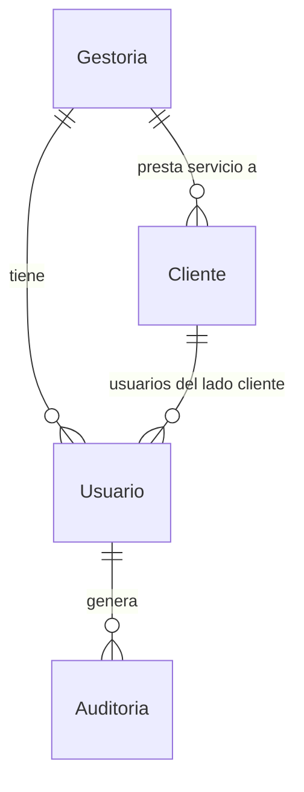
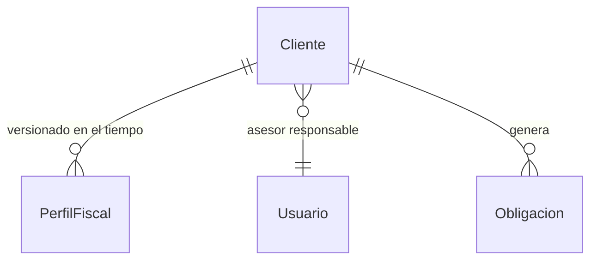
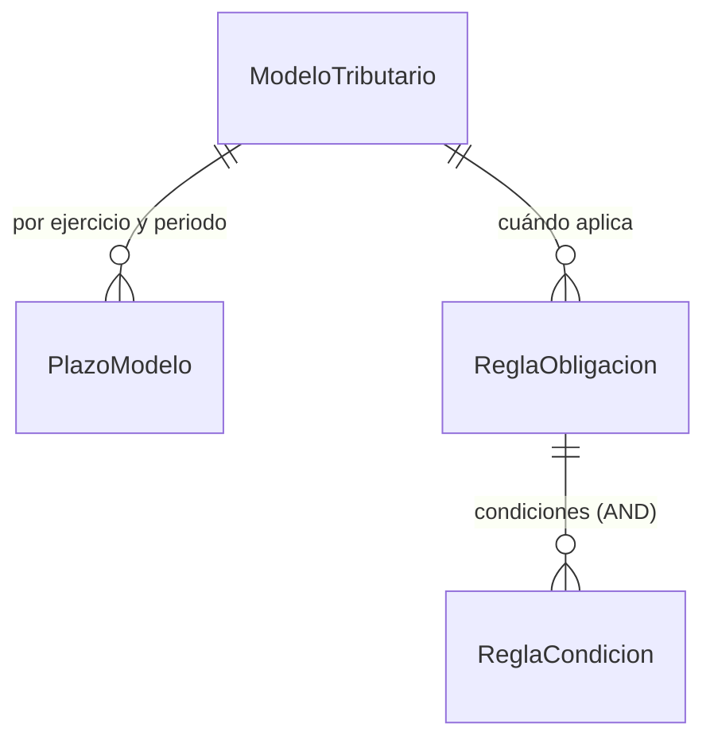
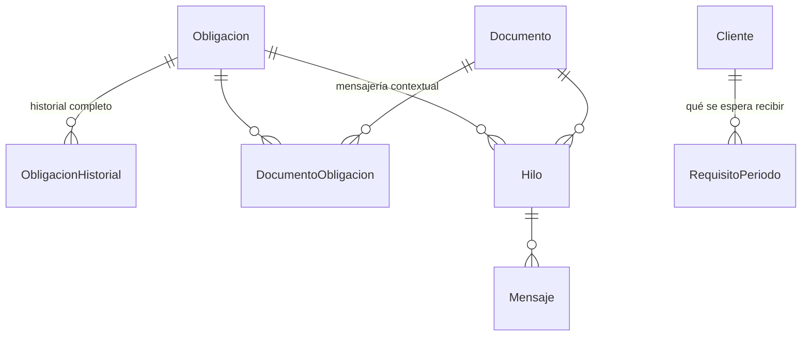
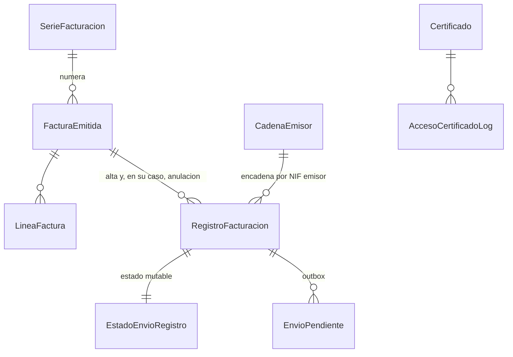

# 04 · Modelo de datos

> **Estado:** vigente · **Versión:** 1.0 · **Fecha:** 2026-09-22
> Fuente de verdad del esquema: los scripts de `Scripts/Migrations/`. Este documento explica **por qué** el esquema es así. Si ambos discrepan, manda el script y hay que corregir este documento.
> Convenciones de scripts y runner: [13-migraciones-y-datos.md](13-migraciones-y-datos.md). Reglas de dominio `RD-nn`: [01-mapa-dominio.md](01-mapa-dominio.md) §5.

---

## 1. Convenciones generales

| Aspecto | Decisión | Por qué |
|---|---|---|
| Idioma | Tablas y columnas **en español**, sin tildes ni `ñ` | El lenguaje ubicuo del dominio es español (ADR-001 §2.8) |
| Nombres | Singular y `PascalCase`: `Cliente`, `Obligacion`, `RegistroFacturacion` | Coincide con las entidades EF; menos fricción |
| Esquemas SQL | `dbo` para todo salvo `vf` (facturación Veri\*Factu) y `cat` (catálogo normativo) | La frontera de permisos y de inalterabilidad es más clara si es también una frontera de esquema |
| Clave primaria de entidades | `uniqueidentifier` con `DEFAULT NEWSEQUENTIALID()` | Secuencial ⇒ sin fragmentación del índice agrupado; opaca ⇒ no filtra volumen de negocio en URL |
| Clave primaria de tablas de sólo-anexado | `bigint IDENTITY` | Volumen alto, orden natural, y el número de orden tiene significado (cadena, auditoría) |
| Importes | `decimal(18,2)` · Tipos y porcentajes: `decimal(5,2)` | Nunca `float` con dinero |
| Fechas sin hora | `date` | Plazos y fechas de expedición son fechas civiles, no instantes |
| Instantes | `datetime2(3)` en UTC | Un solo huso en base de datos; se presenta en local |
| Instante con huso | `datetimeoffset(0)` **+ la cadena literal** usada en el XML | Ver §6.3: la huella se calcula sobre el **texto**; guardar sólo el instante no permite reproducirla |
| Columna de tenant | `GestoriaId uniqueidentifier NOT NULL` en toda tabla multi-tenant | Base de los filtros de EF y de la política RLS (RD-04) |
| Borrado | **No hay borrado físico** en entidades de negocio: `Estado` o `FechaBaja` | Trazabilidad; y en facturación está prohibido por norma (RD-06) |
| Texto libre | `nvarchar` siempre (nunca `varchar`) | Nombres con acentos, y los campos que van al XML de la AEAT son Unicode |

### 1.1 Aislamiento multi-tenant (RD-04)

Toda tabla con `GestoriaId` lleva:

```sql
CREATE FUNCTION dbo.fn_FiltroTenant(@GestoriaId uniqueidentifier)
RETURNS TABLE WITH SCHEMABINDING AS
RETURN SELECT 1 AS Permitido
WHERE @GestoriaId = CAST(SESSION_CONTEXT(N'GestoriaId') AS uniqueidentifier)
   OR CAST(SESSION_CONTEXT(N'EsMantenimiento') AS bit) = 1;
```

aplicada con una `SECURITY POLICY` con `FILTER PREDICATE` **y** `BLOCK PREDICATE` (este último impide insertar filas de otro tenant, que es el ataque que un filtro de lectura no cubre).

> ✅ **Verificado el 2026-09-22 contra la base `Aserta` real:** con dos filas de dos tenants, cada uno ve exactamente la suya y el `BLOCK PREDICATE` rechaza insertar en nombre de otro. Funciona **también para `db_owner`**: RLS no se salta por ser propietario de la base. El `SESSION_CONTEXT` lo fija un interceptor de conexión de EF Core; los trabajos de fondo abren un ámbito por tenant, y sólo el runner de migraciones y el seed usan `EsMantenimiento`.

> El catálogo normativo (`cat.*`) **no lleva `GestoriaId`** y queda fuera de la política: es el mismo para todas las gestorías.

---

## 2. Núcleo (M0)



| Tabla | Columnas principales | Notas |
|---|---|---|
| `dbo.Gestoria` | `Id`, `Nombre`, `Nif`, `Estado`, `FechaAlta`, `ZonaHoraria`, `ExigeAprobacionCliente bit`, `AsesorVeTodosLosClientes bit` | Las dos últimas materializan RD-07 y RD-09 como **configuración del tenant**, no como constante de código |
| `dbo.Usuario` | `Id` (= `AspNetUsers.Id`), `GestoriaId`, `ClienteId NULL`, `NombreCompleto`, `Estado`, `MfaObligatorio` | Extiende Identity. `ClienteId` no nulo ⇒ usuario del lado cliente |
| `dbo.Auditoria` | `Id bigint`, `GestoriaId`, `UsuarioId`, `FechaUtc`, `Accion`, `EntidadTipo`, `EntidadId`, `Detalle nvarchar(max)`, `DireccionIp`, `AgenteUsuario` | **Sólo-anexado** (RD-08): trigger `INSTEAD OF UPDATE, DELETE` + `DENY`. La IP real viene de `ForwardedHeaders` |
| `dbo.MigracionAplicada` | `Nombre PK`, `HashSha256`, `FechaAplicacionUtc`, `DuracionMs` | La usa el runner; sin ella no arranca la aplicación |
| `dbo.EjecucionProgramada` | `Tarea PK`, `UltimaEjecucionUtc`, `ProximaEjecucionUtc`, `Estado` | Evita que un reinicio duplique o se salte el trabajo diario |

Los roles (`SocioDirector`, `Asesor`, `Administrativo`, `ClienteAdmin`, `ClienteUsuario`) viven en las tablas de Identity.

**Índices:** `Auditoria (GestoriaId, EntidadTipo, EntidadId, FechaUtc DESC)` para la pestaña de historial, y `Auditoria (GestoriaId, FechaUtc DESC)` para el registro general.

---

## 3. Clientes y perfil fiscal (M1)



### 3.1 `dbo.Cliente`

`Id`, `GestoriaId`, `Nif`, `RazonSocial`, `NombreComercial`, `FormaJuridica`, `Email`, `Telefono`, `Direccion*`, `AsesorResponsableId`, `FechaAlta`, `FechaBaja NULL`, `Estado`, `Notas`.

- `UNIQUE (GestoriaId, Nif)` — el mismo NIF puede estar en dos gestorías distintas (cambio de asesoría), pero no dos veces en la misma.
- La **validación del dígito de control** de NIF/CIF se hace en el dominio, no con `CHECK`: las reglas son demasiado ricas (NIF, NIE, CIF con letra o dígito) para SQL, y necesitan mensaje de error explicativo.

### 3.2 `dbo.PerfilFiscal` — **versionado temporal**

`Id`, `ClienteId`, `VigenteDesde date`, `VigenteHasta date NULL`, `RegimenIrpf`, `RegimenIva`, `PeriodicidadIva`, `TieneEmpleados`, `PagaProfesionalesConRetencion`, `AlquilaLocal`, `RepartePagosCapitalMobiliario`, `OperacionesIntracomunitarias`, `SuperaUmbral347`, `Territorio`, `FechaCierreEjercicio`.

> **Por qué versionado y no un puñado de columnas en `Cliente`.** Un autónomo que contrata a su primer empleado en julio pasa a tener obligación de 111 **a partir del 3T**, no desde enero. Si el perfil fuera un único registro mutable, al cambiarlo perderíamos la razón por la que se generaron las obligaciones de los trimestres anteriores y el motor no podría reejecutarse sin destrozar el histórico. Es el riesgo D1 de `01-mapa-dominio.md`, y se resuelve aquí, en el esquema.

- Restricción: como máximo **un** perfil con `VigenteHasta IS NULL` por cliente (índice único filtrado).
- El motor de obligaciones resuelve, para cada periodo, **qué perfil estaba vigente al inicio del periodo** `[VERIFICAR]` — el criterio exacto (inicio, fin o cualquier día del periodo) debe confirmarse con un asesor fiscal; está aislado en un único método del dominio precisamente para poder cambiarlo.

---

## 4. Catálogo normativo (`cat`, sin tenant)



| Tabla | Contenido |
|---|---|
| `cat.ModeloTributario` | `Codigo PK` ('303','130','111'…), `Nombre`, `Descripcion`, `DescripcionCliente`, `Periodicidad`, `EsInformativo`, `EsResumenAnualDe` |
| `cat.PlazoModelo` | `Id`, `ModeloCodigo`, `Ejercicio`, `Periodo`, `FechaInicioPresentacion`, `FechaLimiteDomiciliacion`, `FechaLimitePresentacion`, `Fuente`, `Confirmado bit` |
| `cat.ReglaObligacion` | `Id`, `ModeloCodigo`, `Descripcion`, `Periodicidad`, `VigenteDesdeEjercicio`, `VigenteHastaEjercicio`, `Prioridad`, `Activa` |
| `cat.ReglaCondicion` | `Id`, `ReglaId`, `Atributo`, `Operador` (`=`,`<>`,`IN`), `Valor` |
| `cat.DiaInhabil` | `Fecha`, `Ambito` ('Nacional', …), `Descripcion` |

**El motor de obligaciones es esto y nada más** (RD-01): para cada cliente y ejercicio, se evalúan las reglas activas contra el perfil fiscal vigente; cada regla que se cumple genera las obligaciones de sus periodos con los plazos de `cat.PlazoModelo`. Añadir un modelo nuevo o cambiar una condición es un `INSERT`, no un despliegue.

**`Confirmado bit`** en `PlazoModelo` es el `[VERIFICAR]` hecho dato: un plazo cargado del seed sin contrastar contra el calendario oficial del contribuyente de la AEAT entra con `Confirmado = 0`, y la interfaz lo muestra con una marca. Una gestoría no puede confiar ciegamente en una fecha que nadie ha comprobado, y esconderlo sería peor que enseñarlo.

**Traslado por día inhábil (RD-03):** el seed guarda **la fecha ya trasladada**, y `cat.DiaInhabil` permite recalcular y verificar. Guardar la fecha calculada evita que el semáforo dependa de ejecutar bien una función en cada consulta.

---

## 5. Obligaciones, documental y mensajería (M2, M3, M4)



### 5.1 `dbo.Obligacion` — la entidad central

`Id`, `GestoriaId`, `ClienteId`, `ModeloCodigo`, `Ejercicio smallint`, `Periodo` ('1T','2T','3T','4T','01'…'12','AN'), `Estado`, `AsesorId`, `FechaLimiteDomiciliacion`, `FechaLimitePresentacion`, `ImporteResultado decimal(18,2) NULL`, `SignoResultado` (ingresar/devolver/compensar/sin actividad), `FechaAprobacionClienteUtc NULL`, `UsuarioAprobacionId NULL`, `JustificanteDocumentoId NULL`, `OrdenEnColumna int`, `ReglaOrigenId`, `FechaGeneracionUtc`.

- `UNIQUE (GestoriaId, ClienteId, ModeloCodigo, Ejercicio, Periodo)` — **es la clave que hace idempotente al motor** (riesgo D1): reejecutarlo no duplica nada.
- Estado `NoAplica` en lugar de borrado (§5.1 del mapa de dominio).
- **El semáforo no es una columna**: se calcula sobre `FechaLimiteDomiciliacion` (RD-02). Materializarlo obligaría a un trabajo nocturno que recorre toda la tabla para cambiar colores; calcularlo es gratis y nunca está obsoleto.

**Índices** (son los que sostienen el Kanban y el cuadro de mando, la pantalla más cargada del producto):

```sql
IX_Obligacion_Tablero  (GestoriaId, Estado, FechaLimiteDomiciliacion)
      INCLUDE (ClienteId, ModeloCodigo, Ejercicio, Periodo, AsesorId)
IX_Obligacion_Asesor   (GestoriaId, AsesorId, Estado, FechaLimiteDomiciliacion)
IX_Obligacion_Cliente  (GestoriaId, ClienteId, Ejercicio, Periodo)
```

### 5.2 `dbo.ObligacionHistorial` — sólo-anexado (RD-08)

`Id bigint`, `ObligacionId`, `FechaUtc`, `UsuarioId`, `TipoEvento`, `EstadoAnterior`, `EstadoNuevo`, `Comentario`, `ReferenciaId`.

Es lo que permite el criterio de calidad *"cada tarjeta muestra su historial completo"*: cambios de estado, documentos vinculados, mensajes, aprobación del cliente y archivo del justificante, todo en una línea de tiempo.

### 5.3 `dbo.Documento`

`Id`, `GestoriaId`, `ClienteId`, `Tipo`, `Ejercicio`, `Periodo`, `NombreOriginal`, `ClaveAlmacen uniqueidentifier`, `HashSha256`, `TamanoBytes`, `TipoMime`, `Estado`, `MotivoRechazo`, `SubidoPorId`, `FechaSubidaUtc`, `RevisadoPorId`, `FechaRevisionUtc`, `DatosExtraidos nvarchar(max) NULL`, `OrigenExtraccion`.

- El fichero **no se guarda en base de datos**: vive en `IAlmacenDocumental` bajo un nombre opaco (`ClaveAlmacen`), fuera del directorio de despliegue y cifrado en reposo.
- `HashSha256` detecta duplicados: subir dos veces la misma foto del mismo ticket es lo más frecuente que hace un cliente desde el móvil.
- `DatosExtraidos` es JSON del adaptador OCR/IA (simulado en la demo). Dato **sugerido**, nunca autoritativo: lo confirma el gestor.

### 5.4 `dbo.RequisitoPeriodo` — *"te faltan 2 facturas de julio"*

`Id`, `GestoriaId`, `ClienteId`, `Ejercicio`, `Periodo`, `TipoDocumento`, `CantidadEsperada NULL`, `Obligatorio`, `Descripcion`.

Sin esta tabla, el portal del cliente sólo puede decir *"documentación incompleta"*, que es exactamente el lenguaje técnico que el criterio de calidad §8 prohíbe. Se genera a partir del perfil fiscal junto con las obligaciones y se puede ajustar cliente a cliente.

### 5.5 Mensajería

`dbo.Hilo` (`Id`, `GestoriaId`, `ClienteId`, `ObligacionId NULL`, `DocumentoId NULL`, `Asunto`, `Estado`, `FechaUltimoMensajeUtc`) y `dbo.Mensaje` (`Id bigint`, `HiloId`, `AutorId`, `FechaUtc`, `Cuerpo`, `LeidoPorClienteUtc`, `LeidoPorGestoriaUtc`).

`CHECK`: un hilo tiene **exactamente uno** de `ObligacionId` / `DocumentoId` informado. No hay chat suelto (decisión de producto de `01-mapa-dominio.md` §4.3).

---

## 6. Facturación Veri\*Factu (`vf`, M6)

> Especificación normativa completa en [06-verifactu/](06-verifactu/). Aquí sólo el esquema y las razones de sus restricciones.



### 6.1 Tablas **inmutables** (RD-06)

`vf.FacturaEmitida`, `vf.LineaFactura`, `vf.RegistroFacturacion`. Las tres llevan:

```sql
CREATE TRIGGER vf.TR_FacturaEmitida_Inalterable ON vf.FacturaEmitida
INSTEAD OF UPDATE, DELETE AS
  THROW 50001, N'Las facturas emitidas son inalterables (RD 1007/2023). Use rectificativa o anulacion.', 1;
```

más `DENY UPDATE, DELETE ON SCHEMA::vf TO aserta_app` con `GRANT` selectivo de `UPDATE` sólo a `vf.EstadoEnvioRegistro`, `vf.EnvioPendiente` y `vf.CadenaEmisor`.

> ⚠️ **Estado real (verificado el 2026-09-22).** El trigger está comprobado y **detiene `UPDATE` y `DELETE` incluso ejecutados por `db_owner`**. El `DENY`, en cambio, **no se puede aplicar hoy**: el usuario disponible (`agente_ro`) es `db_owner`. El login `aserta_app` aún no existe y hay que pedirlo — ver [12-infraestructura-despliegue.md](12-infraestructura-despliegue.md) §3.2. Escribir igualmente el `DENY` en el script de migración, condicionado a que el login exista, para que la segunda barrera entre en vigor automáticamente el día que se cree.

**Ésta es la razón de que el estado del envío viva en otra tabla.** El estado cambia muchas veces (en cola → enviado → aceptado); el registro no cambia nunca. Meterlos juntos obligaría a permitir `UPDATE` sobre el registro, y entonces la inalterabilidad sería una promesa en vez de una garantía.

### 6.2 `vf.FacturaEmitida`

`Id`, `GestoriaId`, `ClienteEmisorId`, `NifEmisor char(9)`, `SerieId`, `NumSerieFactura nvarchar(60)`, `FechaExpedicion date`, `TipoFactura` (`F1`,`F2`,`F3`,`R1`…`R5`), `DestinatarioNif`, `DestinatarioNombre`, `BaseTotal`, `CuotaTotal`, `CuotaRecargoTotal`, `RetencionTotal`, `ImporteTotal`, `Descripcion`, `FechaHoraCreacionUtc`, `UsuarioId`, `TipoRectificativa NULL`, `FacturaRectificadaId NULL`, `PdfClaveAlmacen NULL`.

- `UNIQUE (NifEmisor, NumSerieFactura)`. El límite de 60 caracteres **no es arbitrario**: es el máximo del parámetro `numserie` de la URL del QR (§7 de `06-verifactu/qr-y-pdf.md`). Permitir más largo en base de datos produciría facturas cuyo QR no se puede cotejar.
- `ImporteTotal` con `decimal(18,2)`; la parte entera del parámetro del QR admite hasta 12 dígitos.
- Rectificativas: `FacturaRectificadaId` apunta a la original, que **permanece intacta**.

### 6.3 `vf.RegistroFacturacion` — el corazón

`Id bigint IDENTITY`, `GestoriaId`, `NifEmisor char(9)`, `Tipo` (`ALTA` | `ANULACION`), `FacturaEmitidaId`, `NumeroEnCadena bigint`, `PrimerRegistro bit`, `HuellaAnterior char(64) NULL`, `Huella char(64)`, `FechaHoraHusoGenRegistro datetimeoffset(0)`, **`FechaHoraHusoGenRegistroTexto varchar(25)`**, `CadenaHuella nvarchar(1000)`, `XmlRegistro nvarchar(max)`, `IdSistemaInformatico`, `VersionSistemaInformatico`, `NumeroInstalacion`.

- `UNIQUE (NifEmisor, NumeroEnCadena)` — impide huecos y duplicados en la cadena (RD-05).
- **`FechaHoraHusoGenRegistroTexto` y `CadenaHuella` no son redundancia: son la prueba.** La huella se calcula sobre una **cadena de texto** (`06-verifactu/huella-y-vectores-prueba.md`); si sólo guardáramos el `datetimeoffset`, reconstruir esa cadena años después dependería de que el formateo, la cultura y la versión de la librería no hayan cambiado nunca. Guardando el texto exacto que se hasheó, cualquiera puede reverificar la cadena entera con tres líneas de código. Cuesta ~1 KB por factura y vale su peso en oro en una inspección.
- `XmlRegistro` guarda el XML exactamente como se remitió.

### 6.4 `vf.CadenaEmisor` — control de concurrencia (RD-05)

`NifEmisor char(9) PK`, `UltimaHuella char(64) NULL`, `UltimoNumero bigint`, `FechaUltimoRegistroUtc`, `GestoriaId`.

Una fila por NIF emisor, leída con `WITH (UPDLOCK, HOLDLOCK)` dentro de la transacción de emisión. Dos facturas simultáneas del mismo emisor se serializan; de emisores distintos, no se estorban. La alternativa (`sp_getapplock` con el NIF como recurso) y la justificación completa van en un ADR propio de la especificación Veri\*Factu.

> **Ojo:** la fila de `CadenaEmisor` debe existir **antes** de la primera factura. Se crea al dar de alta la serie de facturación del emisor, no perezosamente en la emisión: crearla al vuelo dentro de una transacción con bloqueo es la receta clásica del *deadlock* bajo concurrencia.

### 6.5 Estado y cola

| Tabla | Columnas | Mutable |
|---|---|---|
| `vf.EstadoEnvioRegistro` | `RegistroFacturacionId PK`, `Estado`, `Intentos`, `FechaEnvioUtc`, `FechaRespuestaUtc`, `CsvAeat`, `CodigoErrorAeat`, `DescripcionErrorAeat`, `LoteEnvioId` | **Sí** |
| `vf.EnvioPendiente` *(outbox)* | `Id bigint`, `RegistroFacturacionId`, `GestoriaId`, `NifEmisor`, `FechaAltaUtc`, `ProximoIntentoUtc`, `Intentos`, `Estado`, `LoteEnvioId NULL` | **Sí** |
| `vf.LoteEnvio` | `Id`, `NifEmisor`, `FechaEnvioUtc`, `NumRegistros`, `RespuestaXml`, `TiempoEsperaSegundos`, `Resultado` | **Sí** |
| `vf.Certificado` | `Id`, `GestoriaId`, `NifTitular`, `Tipo`, `HuellaDigital`, `ValidoDesde`, `ValidoHasta`, `MaterialCifrado varbinary(max)`, `Estado` | Sí |
| `vf.Apoderamiento` | `Id`, `GestoriaId`, `ClienteId`, `Alcance`, `FechaAlta`, `FechaFin NULL`, `DocumentoRespaldoId` | Sí |
| `vf.AccesoCertificadoLog` | `Id bigint`, `CertificadoId`, `UsuarioId NULL`, `FechaUtc`, `Motivo`, `NifObligado` | **Sólo-anexado** |

Índice de la cola: `IX_EnvioPendiente_Trabajo (Estado, ProximoIntentoUtc, NifEmisor) INCLUDE (RegistroFacturacionId)`, que es el que sirve la lectura con `READPAST, UPDLOCK, ROWLOCK` del worker.

La fila de `EnvioPendiente` se inserta **en la misma transacción** que el registro (patrón outbox). Si la transacción se confirma, el envío ocurrirá; si se deshace, no hay ni factura ni cola. No hay ventana en la que exista una factura que nunca se enviará, que es justo el fallo que una cola en memoria produce cada vez que el proceso se reinicia en mal momento.

### 6.6 Catálogos del emisor

`vf.SerieFacturacion` (`Id`, `GestoriaId`, `ClienteEmisorId`, `Codigo`, `Descripcion`, `Ejercicio`, `UltimoNumero`, `Activa`), `vf.Destinatario`, `vf.ArticuloServicio`. Son mutables: no forman parte del registro inalterable, sólo lo alimentan.

---

## 7. Exportación contable (M5)

| Tabla | Columnas | Notas |
|---|---|---|
| `dbo.ExportacionContable` | `Id`, `GestoriaId`, `ClienteId`, `Formato`, `Ejercicio`, `Periodo`, `FechaGeneracionUtc`, `UsuarioId`, `ClaveAlmacen`, `NumRegistros`, `HashSha256` | El fichero generado se conserva: es la prueba de lo que se entregó |
| `dbo.ExportacionDocumento` | `ExportacionId`, `DocumentoId`, `PK` compuesta | Materializa RD-11: si un documento ya está aquí, no se reexporta salvo petición explícita |

---

## 8. Riesgos y mejoras sugeridas

| # | Riesgo / observación | Propuesta |
|---|---|---|
| M1 | **`SESSION_CONTEXT` y el pool de conexiones.** Si una conexión vuelve al pool con el contexto de otro tenant, RLS filtra mal — y en el sentido peligroso | El interceptor fija el contexto **al abrir** y lo limpia al cerrar; hay test de integración que alterna tenants sobre el mismo pool. Es el punto que más vigilancia merece de todo el esquema |
| M2 | **Crecimiento de `Auditoria` y `ObligacionHistorial`** | Partición o archivado por año desde el principio del diseño; en la demo no hace falta, pero la columna de fecha ya está preparada para ser la clave de partición |
| M3 | El motor genera N obligaciones × M clientes de golpe (una gestoría con 400 clientes ⇒ ~4.000 filas por ejercicio) | Generación por lotes con `TVP` o `MERGE`, y ejecución en segundo plano con progreso visible. Nunca dentro de una petición HTTP |
| M4 | **El semáforo calculado** complica filtrar y ordenar por él en SQL | Se filtra por rangos de `FechaLimiteDomiciliacion`, que usa el índice. Si algún día hace falta, columna calculada persistida — pero depende de la fecha de hoy, así que no puede persistirse: hay que filtrar por fecha. Documentado aquí para que nadie lo intente |
| M5 | `CadenaEmisor` es un punto de serialización por emisor | Correcto y deseado: la norma exige orden. El cuello sólo aparecería con un emisor facturando cientos de veces por segundo, que no es el caso de ningún cliente de gestoría |
| M6 | Guardar `XmlRegistro` y `CadenaHuella` engorda la tabla | ~3–5 KB por factura. Con 100.000 facturas son ~400 MB. Aceptable; y `nvarchar(max)` se almacena fuera de fila. Si molesta, comprimir con `COMPRESS()` |
| M7 | La validación de NIF en dominio y no en `CHECK` permite datos malos si alguien inserta por SQL | Aceptado: el seed y las migraciones son los únicos que insertan por SQL y están controlados. Un `CHECK` de longitud y formato básico sí se pone |
