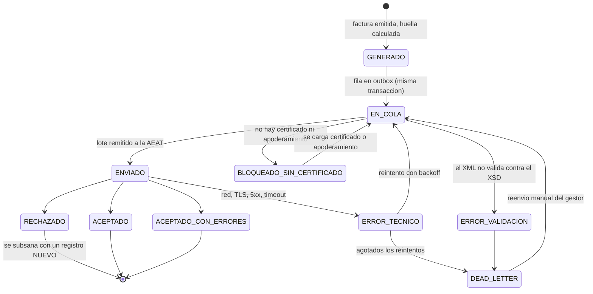
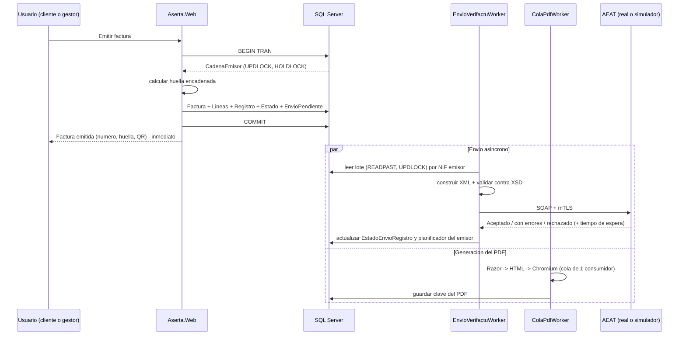

# 06.3 · Envío a la AEAT y cola de reintentos

> **Estado:** vigente · **Versión:** 1.0 · **Fecha:** 2026-09-22
> Relacionado: [ADR-002](../adr/ADR-002-certificado-y-representacion-verifactu.md) (certificado), [04-modelo-datos.md](../04-modelo-datos.md) §6.5 (tablas), [ADR-001](../adr/ADR-001-arquitectura-general-y-estructura-de-solucion.md) §2.5 (trabajos de fondo).

---

## 1. El principio que gobierna todo este módulo

> **La factura se emite, se registra, se calcula su huella y se imprime con su QR INMEDIATAMENTE, con independencia de que la AEAT responda. El envío es asíncrono.**

No es una optimización: es un requisito de negocio. Un autónomo en su taller no puede quedarse sin poder entregar una factura porque un servicio web de la Administración tenga un mal día. Todo el diseño de esta página existe para sostener esa frase.

Consecuencias inmediatas:

1. La emisión **no** llama a la AEAT. Escribe en base de datos y termina.
2. El envío vive en una **cola persistente**, no en memoria.
3. Un fallo de red, una caída de la AEAT o un reinicio del servidor **no pueden perder un registro**.
4. El usuario ve en todo momento en qué estado está cada envío, sin que eso le impida seguir facturando.

## 2. La cola: patrón *outbox* sobre SQL Server

Sin Redis, sin RabbitMQ, sin Hangfire (restricción de infraestructura: instancia única, RAM escasa).

**En la misma transacción** que crea la factura y su registro se inserta la fila de `vf.EnvioPendiente`:

```
BEGIN TRAN
  SELECT ... FROM vf.CadenaEmisor WITH (UPDLOCK, HOLDLOCK) WHERE NifEmisor = @nif
  INSERT vf.FacturaEmitida ...
  INSERT vf.LineaFactura ...
  INSERT vf.RegistroFacturacion ...        -- huella calculada aquí
  UPDATE vf.CadenaEmisor SET UltimaHuella = @huella, UltimoNumero = @n
  INSERT vf.EstadoEnvioRegistro (Estado = 'EN_COLA')
  INSERT vf.EnvioPendiente (...)           -- outbox, misma transacción
COMMIT
```

Si la transacción se confirma, el envío **ocurrirá**. Si se deshace, no hay ni factura ni cola. **No existe ningún instante en el que haya una factura emitida que nadie vaya a enviar** — que es exactamente el fallo que produce una cola en memoria cada vez que el proceso se reinicia en mal momento.

### 2.1 El consumidor

`EnvioVerifactuWorker`, un `BackgroundService` del propio proceso. Lee así:

```sql
SELECT TOP (@lote) ...
FROM vf.EnvioPendiente WITH (READPAST, UPDLOCK, ROWLOCK)
WHERE Estado = 'PENDIENTE' AND ProximoIntentoUtc <= SYSUTCDATETIME()
  AND NifEmisor = @nif
ORDER BY Id
```

`READPAST` salta las filas que otro proceso esté trabajando, `UPDLOCK` reserva las que toma. Hoy hay una sola instancia y no hace falta; **cuesta lo mismo hacerlo bien ahora** y evita un rediseño el día que haya dos.

### 2.2 Agrupación por emisor

Los envíos se agrupan **por NIF emisor**, por dos razones: el certificado se resuelve por obligado ([ADR-002](../adr/ADR-002-certificado-y-representacion-verifactu.md) §3.1), y el control de flujo de la AEAT se aplica por remitente. Un lote nunca mezcla emisores.

## 3. El servicio web de la AEAT

| Aspecto | Decisión |
|---|---|
| Protocolo | **SOAP** sobre HTTPS con **autenticación mutua TLS** (mTLS) |
| Definición | `SistemaFacturacion.wsdl` + XSD oficiales, **descargados y versionados** en `src/Aserta.Verifactu/Esquemas/` |
| Direcciones | Preproducción (Portal de Pruebas Externas) y producción, **por configuración**. URLs exactas `[VERIFICAR]` en la página *«WSDL de los servicios web»* de la sede de la AEAT. **Prohibido escribirlas de memoria** |
| Cliente | Clases generadas desde el XSD con `XmlSerializer` y **sobre SOAP construido explícitamente** sobre `HttpClient`, en lugar de `dotnet-svcutil` |
| Certificado | `X509CertificateLoader` (PKCS#12) → `HttpClientHandler.ClientCertificates`; **un `HttpClient` por certificado** vía `IHttpClientFactory` |
| Validación previa | El XML se **valida contra el XSD antes de enviarse**. Si no valida, no sale: pasa a `ERROR_VALIDACION` con el detalle |

> **Por qué XSD + sobre SOAP manual y no `dotnet-svcutil`.** El código que genera `svcutil` arrastra la pila de WCF, es opaco cuando algo falla y dificulta validar el documento exacto que se envía. Construyendo el sobre nosotros: (a) validamos contra el XSD **el XML literal** que va a salir; (b) lo guardamos tal cual en `vf.RegistroFacturacion.XmlRegistro`, que es nuestra prueba; (c) el proyecto `Aserta.Verifactu` se mantiene sin dependencias pesadas y testeable. El coste —escribir el sobre— son unas decenas de líneas. **Queda registrado como decisión revisable**: si la serialización manual se complica, se reevalúa.

### 3.1 Control de flujo

La AEAT limita el ritmo de envío. Según fuentes **secundarias coincidentes** `[VERIFICAR]` **contra la especificación oficial del servicio web antes de implementar**:

- máximo **1.000 registros por envío**;
- la respuesta incluye un **tiempo de espera** (`TiempoEsperaEnvio`) que el sistema debe respetar antes del siguiente envío;
- si se envía antes de tiempo, la AEAT responde indicando los segundos restantes.

El worker implementa esto como **un planificador por NIF emisor**: cada emisor tiene su propio *próximo instante permitido*, que se actualiza con el valor devuelto por la AEAT. Un emisor en espera no bloquea a los demás.

> **Esto no se codifica como constante.** El tamaño de lote y el tiempo de espera por defecto van en configuración, y el valor devuelto por la AEAT **siempre manda** sobre el configurado. Un límite grabado en el código es un despliegue de urgencia el día que la Administración lo cambie.

## 4. Interpretación de la respuesta

| Respuesta | Estado resultante | Acción |
|---|---|---|
| Aceptado | `ACEPTADO` | Guardar CSV/acuse y fecha. Fin |
| Aceptado con errores | `ACEPTADO_CON_ERRORES` | Guardar CSV **y** el detalle del error. **Alerta roja al gestor y al socio** |
| Rechazado | `RECHAZADO` | No se reintenta: reintentar lo mismo dará lo mismo. Requiere **subsanación** (registro nuevo) |
| Error técnico (red, TLS, 5xx, timeout) | `ERROR_TECNICO` | **Reintentable** con retroceso exponencial |
| Sin certificado o sin apoderamiento | `BLOQUEADO_SIN_CERTIFICADO` | No se intenta. Alerta al gestor ([ADR-002](../adr/ADR-002-certificado-y-representacion-verifactu.md) §3.1) |

> **`ACEPTADO_CON_ERRORES` merece alerta roja, no ámbar.** El caso típico es que *nuestra* huella no coincida con la calculada por la AEAT, y eso significa que la implementación tiene un defecto estructural que afectará a **todas** las facturas siguientes de **todos** los emisores. Tratarlo como una advertencia menor es la forma de descubrirlo tres meses tarde.

Se persiste siempre el **CSV/acuse** y el XML de respuesta completo.

## 5. Estados y reintentos



### 5.1 Política de reintentos

- **Retroceso exponencial con *jitter***: base 30 s, factor 2, techo 1 h, con aleatorización de ±20 %.
- El *jitter* no es adorno: sin él, tras una caída de la AEAT todos los envíos pendientes vuelven **a la vez**, y el resultado es una segunda caída provocada por nosotros.
- Máximo **8 intentos**; después, `DEAD_LETTER` con **alerta al gestor** y opción de **reenvío manual** desde la interfaz.
- Un registro en `DEAD_LETTER` **nunca se descarta**. La factura ya está emitida y su obligación de remisión sigue viva.

### 5.2 Secuencia de emisión



Obsérvese que la respuesta al usuario ocurre **antes** de que nada se envíe. Es el punto central de este documento.

## 6. El simulador de AEAT

Adaptador `SimuladorAeat`, implementación de `IClienteAeatVerifactu` con **exactamente el mismo contrato** que el real. Es la implementación por defecto en la demo (DA-05).

**Debe permitir provocar a voluntad, desde una pantalla de la propia aplicación:**

| Escenario | Para qué sirve en la demo |
|---|---|
| Respuesta correcta con latencia configurable | Comportamiento normal |
| **Caída total** (el servicio no responde) | El momento estrella: se tira la AEAT, se emiten tres facturas, se enseña la cola llena y se restaura para verla vaciarse sola |
| Latencia alta | Enseñar que la emisión no se bloquea |
| Rechazo con código de error | Enseñar el flujo de subsanación |
| Aceptado con errores | Enseñar la alerta roja |
| Tiempo de espera agresivo | Enseñar el control de flujo y la agrupación en lotes |

> **Es una herramienta de demostración, pero también la mejor herramienta de pruebas que va a tener el equipo.** Reproducir una caída de la AEAT contra el entorno real es imposible; contra el simulador, es un clic. Merece la pena construirlo bien.

**El simulador nunca se activa en producción:** la configuración que lo selecciona está vetada cuando el entorno es `Production`, y la aplicación **no arranca** si se detecta esa combinación. Una demo que envía a un simulador creyendo enviar a la AEAT sería un incidente grave.

## 7. Visibilidad para el usuario

| Rol | Qué ve |
|---|---|
| **Cliente** | Un indicador discreto por factura: *"Registrada en la AEAT"* / *"Pendiente de envío"*. Sin jerga. Nunca un código de error crudo |
| **Asesor** | Bandeja de envíos con estado, intentos, próximo intento y el error literal; reenvío manual |
| **Socio** | En el cuadro de mando: enviados / pendientes / **errores**, y alerta destacada si hay `DEAD_LETTER`, `ACEPTADO_CON_ERRORES` o certificados próximos a caducar |

## 8. Definición de hecho

1. Test: caída del simulador durante N emisiones ⇒ **todas** las facturas se emiten y **todas** quedan en cola; al restaurar, **todas** llegan a `ACEPTADO`.
2. Test: reinicio del proceso con la cola llena ⇒ no se pierde ni se duplica ningún envío.
3. Test: el XML inválido no sale y queda con detalle del error de validación.
4. Test: respeto del tiempo de espera devuelto por la AEAT, por emisor y sin bloquear a otros emisores.
5. Test: `DEAD_LETTER` tras agotar reintentos, con alerta generada **una sola vez**.
6. Test: arrancar con entorno `Production` y simulador configurado ⇒ **la aplicación no arranca**.

## 9. Riesgos y mejoras sugeridas

| # | Riesgo | Propuesta |
|---|---|---|
| E1 | **Los límites de flujo y el nombre del campo de espera provienen de fuentes secundarias** | `[VERIFICAR]` obligatorio contra la especificación oficial del servicio web antes de implementar. En configuración, no en constantes |
| E2 | Tormenta de reintentos tras una caída larga | Retroceso exponencial **con jitter** y techo de 1 h. Es la mitigación, y es obligatoria |
| E3 | La cola crece sin límite si la AEAT está caída días | Métrica de profundidad de cola y alerta a partir de un umbral. La emisión **no** se bloquea: el principio de §1 manda |
| E4 | Un reinicio en medio de un lote podría dejar filas marcadas como en curso | Marca de "en curso" con caducidad: un registro tomado hace más de X minutos vuelve a `PENDIENTE`. Test de reinicio (§8.2) |
| E5 | Enviar a preproducción creyendo enviar a producción (o al revés) | Una sola bandera de entorno para QR y servicio web, visible en pantalla cuando no es producción, y comprobación al arrancar |
| E6 | `ACEPTADO_CON_ERRORES` pasando inadvertido | Alerta roja, contador propio en el cuadro de mando y un test que lo verifica |
| E7 | Un único worker puede ser cuello de botella con muchos emisores | El trabajo por emisor es independiente: se puede paralelizar por NIF con un grado de paralelismo configurable. **No hacerlo ahora** (RAM), pero el diseño ya lo permite |
