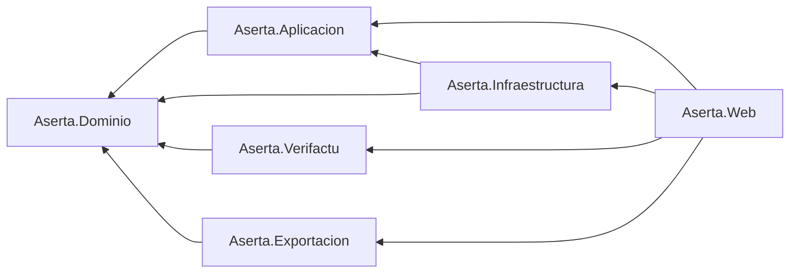

# ADR-001 · Arquitectura general y estructura de la solución

- **Estado:** Aceptada
- **Fecha:** 2026-09-22
- **Decide:** Agente Arquitecto
- **Afecta a:** toda la solución
- **Sustituye a:** —

> **Nota sobre el prefijo de los proyectos.** El encargo usa `GestorFlow.*`; el repositorio y el servidor usan `Aserta`. Este ADR escribe **`Aserta.*`** por ser la recomendación de [DA-01](../decisiones-abiertas.md#da-01--nombre-del-producto-y-del-repositorio-bloqueante). Si se confirma `GestorFlow`, es una sustitución textual en un único commit, **antes** de empezar a programar.

---

## 1. Contexto

Hay que fijar la arquitectura de una plataforma SaaS multi-tenant para gestorías, con un stack **cerrado por el cliente** (.NET 10, Razor Pages, EF Core sobre SQL Server, sin migraciones de EF, Playwright para PDF, Identity) y unas restricciones de infraestructura **severas**: una sola instancia, Linux, RAM escasa y compartida, sin broker de mensajes ni caché distribuida.

Además hay una exigencia normativa que condiciona el diseño más que cualquier consideración de estilo: los registros de facturación de Veri\*Factu son **inalterables y encadenados por NIF emisor**, y deben seguir emitiéndose aunque la AEAT no responda.

Las fuerzas en juego:

| Fuerza | Consecuencia |
|---|---|
| Una sola instancia, poca RAM | Nada de microservicios, brokers, réplicas ni sidecars. El proceso web y los trabajos de fondo viven juntos |
| Veri\*Factu debe ser auditable y testeable aisladamente | Su lógica (huella, XML, QR, cliente AEAT) no puede estar mezclada con Razor Pages ni con EF |
| El motor de obligaciones es reglas de negocio puras | Debe poder probarse sin base de datos |
| Sin migraciones de EF | El esquema es un artefacto de primera clase, mantenido a mano, y el modelo EF puede divergir |
| Aislamiento multi-tenant estricto | Una sola línea olvidada en una consulta no puede filtrar datos de otra gestoría |
| Demo hoy, producto mañana | La estructura debe aguantar el crecimiento sin rediseño, pero sin pagar hoy la complejidad de mañana |

## 2. Decisión

Adoptamos un **monolito modular** de **un único proceso desplegable**, organizado en seis proyectos con una **regla de dependencias unidireccional** y con los puntos de integración externa siempre tras un puerto del dominio.

### 2.1 Estructura de la solución

```
Aserta.sln
  src/
    Aserta.Web/              ← Razor Pages, endpoints JSON, BackgroundServices, composición (DI), wwwroot
    Aserta.Dominio/          ← entidades, value objects, motor de obligaciones, puertos. SIN dependencias
    Aserta.Aplicacion/       ← casos de uso por módulo (M0–M7), DTOs, validación
    Aserta.Infraestructura/  ← EF Core, almacén documental, PDF (Playwright), runner de migraciones, notificador
    Aserta.Verifactu/        ← huella, XML, QR, cliente AEAT (real + simulador). Aislado y testeable
    Aserta.Exportacion/      ← exportadores contables
  tests/
    Aserta.Verifactu.Tests/     ← vectores de prueba de huella, validación XSD
    Aserta.Dominio.Tests/       ← motor de obligaciones, calendario, máquinas de estado
    Aserta.Integracion.Tests/   ← migraciones, RLS, outbox, deriva de esquema
  Scripts/
    Migrations/   ← 0001_*.sql, 0002_*.sql … idempotentes
    Seed/         ← datos de demo (idempotentes, solo entornos no productivos)
```

### 2.2 Regla de dependencias



Reglas duras:

1. **`Aserta.Dominio` no referencia a nadie.** Ni EF Core, ni ASP.NET, ni `System.Net.Http`. Solo BCL.
2. **`Aserta.Aplicacion` solo referencia a `Dominio`.** Declara los puertos que necesita (`IAlmacenDocumental`, `IClienteAeatVerifactu`, `IGeneradorPdf`, `IExportadorContable`, `INotificador`, `IRelojSistema`) y no sabe quién los implementa.
3. **`Aserta.Web` es el único que conoce a todos**, y es el único lugar donde se hace composición (registro en el contenedor de DI).
4. **`Aserta.Verifactu` no referencia a `Infraestructura`.** La persistencia de sus registros se hace a través de puertos; así sus tests corren sin base de datos.
5. Una violación de estas reglas **rompe la compilación de los tests**: `Aserta.Integracion.Tests` incluye un test de arquitectura que inspecciona los ensamblados referenciados de cada proyecto y falla si aparece una dependencia no permitida.

### 2.3 Módulos dentro del monolito

Los módulos M0–M7 son **carpetas con frontera**, no proyectos:

```
Aserta.Aplicacion/
  Nucleo/          (M0)   Tenants, usuarios, roles, auditoría
  Clientes/        (M1)   Ficha, perfil fiscal, motor de obligaciones (orquestación)
  PortalCliente/   (M2)
  Documental/      (M3)
  Obligaciones/    (M4)   Kanban, calendario, avisos
  Exportacion/     (M5)
  Facturacion/     (M6)
  CuadroMando/     (M7)
```

Un módulo **no llama a los tipos internos de otro**: se comunica por los servicios públicos de aplicación del otro módulo o por **eventos de dominio in-process** (un `IPublicadorEventos` sencillo, sin MediatR ni broker). Ejemplo canónico: al validarse un documento, `Documental` publica `DocumentoValidado` y `Obligaciones` reacciona recalculando si la documentación del periodo está completa. Esto es lo que permitiría, si algún día hiciera falta, sacar un módulo del monolito sin reescribirlo.

### 2.4 Multi-tenant: doble barrera

| Capa | Mecanismo | Qué protege |
|---|---|---|
| Aplicación | `HasQueryFilter(e => e.GestoriaId == _contexto.GestoriaId)` en **toda** entidad con tenant | El 99 % de los casos, con buen rendimiento |
| Base de datos | **Row-Level Security** de SQL Server con `SECURITY POLICY` sobre `SESSION_CONTEXT('GestoriaId')` | El 1 % restante: SQL crudo, vistas, un `IgnoreQueryFilters()` olvidado, o un bug |

El `GestoriaId` se resuelve del *claim* del usuario autenticado, se guarda en un `IContextoTenant` con ámbito de petición, y un **interceptor de `DbConnection`** ejecuta `sp_set_session_context 'GestoriaId', @id` al abrir la conexión. Los trabajos de fondo, que no tienen usuario, abren un ámbito por tenant explícitamente.

> Esto es deliberadamente redundante. La barrera de EF es la que da rendimiento; la de SQL Server es la que permite dormir por las noches. En un producto donde cada tenant guarda los datos fiscales de cientos de empresas, una fuga entre tenants no es un bug: es el fin del producto.

### 2.5 Trabajos de fondo

Todos son `BackgroundService` en el propio proceso web. **Sin Hangfire, sin Quartz, sin Redis.**

| Servicio | Qué hace | Cadencia |
|---|---|---|
| `EnvioVerifactuWorker` | Consume la tabla outbox `EnvioPendiente` y remite a la AEAT | Continuo, con respeto del tiempo de espera que devuelve la AEAT `[VERIFICAR]` |
| `ColaPdfWorker` | Consumidor **único** de la cola de generación de PDF (Playwright) | Continuo |
| `AvisosVencimientoWorker` | Avisos a asesores por vencimientos próximos | Diario |
| `ReclamacionDocumentalWorker` | Reclamaciones a clientes con documentación incompleta | Diario |
| `AlertaCaducidadCertificadosWorker` | Avisa a 60/30/7 días de la caducidad de un certificado | Diario |

Los que tienen cadencia diaria comparten un planificador trivial basado en `PeriodicTimer` y una tabla `EjecucionProgramada` que registra la última ejecución, para que un reinicio no duplique ni se salte un día.

**Preparado para varias instancias aunque hoy haya una:** las lecturas de cola usan `WITH (READPAST, UPDLOCK, ROWLOCK)`, de modo que el día que haya dos procesos no se pisen. Cuesta lo mismo hacerlo bien ahora.

### 2.6 Esquema de base de datos y modelo EF

- El esquema lo definen **scripts SQL idempotentes numerados** en `Scripts/Migrations/`, aplicados por un runner al arrancar, que registra cada script con su **hash** y **aborta el arranque** si un script falla o si cambia el hash de uno ya aplicado.
- **Consecuencia operativa:** un script aplicado **nunca se edita**. Toda corrección es un script nuevo. Esto es innegociable y debe estar escrito en el HANDOFF.
- El modelo EF se configura con `IEntityTypeConfiguration<T>` explícitos (sin convenciones mágicas) y se mantiene alineado **a mano**.
- **Cómo se verifica la alineación:** un test de integración (`DerivaDeEsquemaTests`) que, contra una base recién creada por el runner, compara el modelo relacional de EF (`IModel`: tablas, columnas, tipos, nulabilidad, claves) con `INFORMATION_SCHEMA` y falla enumerando las diferencias. Es la red de seguridad que sustituye a `dotnet ef migrations`. Detalle en [13-migraciones-y-datos.md](../13-migraciones-y-datos.md).

### 2.7 Inalterabilidad en la base de datos

Las tablas de facturas emitidas y registros de facturación son **append-only**, reforzado en tres niveles:

1. `TRIGGER INSTEAD OF UPDATE, DELETE` que hace `THROW`;
2. `DENY UPDATE, DELETE` al usuario de la aplicación sobre esas tablas;
3. ausencia de cualquier `Update`/`Remove` en el código, verificada por revisión.

> **Actualización 2026-09-22 — verificado contra la base de datos real.** Los triggers **funcionan incluso para `db_owner`** (probado). En cambio, la barrera 2 **no está disponible** en el entorno de desarrollo actual: el único usuario facilitado (`agente_ro`) es `db_owner`, y SQL Server no permite denegarse permisos a uno mismo ni `db_owner` los respetaría. La inalterabilidad queda por tanto sostenida por **una sola barrera** —fuerte frente a errores de programación, no frente a un uso deliberado desde la propia aplicación, que podría deshabilitar el trigger—. Suficiente para la demo, **insuficiente para producción**: ver la petición de un login `aserta_app` restringido en [12-infraestructura-despliegue.md](../12-infraestructura-despliegue.md) §3.2.

El estado mutable (situación del envío, respuesta de la AEAT, número de reintentos) vive en **tablas separadas** que sí admiten `UPDATE`.

### 2.8 Estilo de código

- Dominio y base de datos **en español** (`Obligacion`, `PerfilFiscal`, `Gestoria`): el lenguaje ubicuo del sector es español y traducirlo genera errores. Sin tildes ni `ñ` en identificadores.
- Términos técnicos en su forma habitual (`Repository`, `Handler`, `Worker`) — no se traducen.
- Nada de patrones por adelantado: sin CQRS, sin MediatR, sin event sourcing, sin repositorios genéricos sobre EF (el `DbContext` **ya** es una unidad de trabajo). Se añadirán si un problema real lo pide.

## 3. Opciones consideradas

| Opción | Por qué no |
|---|---|
| **Microservicios** | Imposible con una instancia y 4 GB; y el dominio no tiene fronteras de escalado independientes |
| **Vertical slices puras** (una carpeta por caso de uso, sin capas) | Buena para equipos que conocen el dominio; aquí el motor de obligaciones y la huella Veri\*Factu son **lógica compartida y muy probada**, y merecen un lugar propio y estable. Se adopta la idea a medias: carpetas por módulo dentro de la capa de aplicación |
| **Proyecto único** | Más simple, pero no impide que Veri\*Factu acabe dependiendo de `HttpContext`, que es exactamente lo que hay que evitar en el componente con obligaciones legales |
| **Blazor Server en lugar de Razor Pages** | Descartado por el stack cerrado, y además cada usuario conectado mantiene estado de circuito en servidor: inviable con esta RAM |
| **Hangfire para trabajos de fondo** | Añade tablas, panel y consumo; `BackgroundService` cubre el caso. Reabrir solo si aparecen trabajos con planificación compleja |
| **Un esquema SQL por tenant** | Aislamiento perfecto, pero mantener N esquemas con scripts manuales y sin migraciones de EF es inasumible |

## 4. Consecuencias

### Positivas
- Un despliegue, un proceso, un `systemd`: encaja con la infraestructura real.
- `Aserta.Verifactu` y `Aserta.Dominio` se prueban sin base de datos ni servidor web: son los dos componentes con riesgo legal y de negocio, y son los más fáciles de probar.
- Las simulaciones de la demo (AEAT, OCR, correo) son implementaciones de puertos ya existentes: cambiar a real es configuración.
- El aislamiento multi-tenant no depende de que nadie se acuerde de filtrar.

### Negativas y cómo se mitigan
| Coste | Mitigación |
|---|---|
| Seis proyectos para una demo es más ceremonia que un proyecto único | Las fronteras son las que evitan el plato de espaguetis en el mes 3. Se asume |
| Mantener el modelo EF alineado a mano es trabajo manual y propenso a fallo | `DerivaDeEsquemaTests` lo convierte en un fallo de test en vez de en un bug de producción |
| Los trabajos de fondo comparten proceso y RAM con la web | Presupuesto de memoria documentado, cola PDF con un solo consumidor, `MemoryMax` en systemd |
| RLS de SQL Server tiene coste en consultas | Se acepta; los filtros de EF evitan que RLS sea el único mecanismo en el camino caliente. Medir antes de optimizar |
| Un módulo puede acabar llamando a los internos de otro sin que nadie lo note | Test de arquitectura + revisión; si crece, `InternalsVisibleTo` y tipos `internal` por módulo |

## 5. Cómo se verifica que esta decisión se cumple

1. `Aserta.Dominio.csproj` **no tiene ninguna** `PackageReference` fuera de la BCL. *(test de arquitectura)*
2. Ningún tipo de `Aserta.Verifactu` referencia `Microsoft.EntityFrameworkCore` ni `Microsoft.AspNetCore`. *(test de arquitectura)*
3. `DerivaDeEsquemaTests` pasa en verde contra una base creada solo con los scripts. *(test de integración)*
4. Un test intenta `UPDATE` sobre una factura emitida y **espera una excepción**. *(test de integración)*
5. Un test abre el contexto como la gestoría A e intenta leer una fila de la gestoría B con `IgnoreQueryFilters()`: debe devolver **cero filas** gracias a RLS. *(test de integración — es el test que demuestra la doble barrera)*

## 6. Riesgos y mejoras sugeridas

- **Riesgo:** el runner de migraciones corre al arrancar; un script lento bloquea el arranque y systemd puede reiniciar el servicio en bucle. **Mitigación:** timeout explícito, `TimeoutStartSec` generoso en la unidad systemd, y log claro antes y después de cada script.
- **Riesgo:** con una sola instancia, desplegar implica corte de servicio. Para la demo es irrelevante; para producción, documentar la ventana y considerar un `nginx` con página de mantenimiento.
- **Mejora:** publicar como **`ReadyToRun`** y `InvariantGlobalization=false` (hacen falta las culturas de España) para reducir tiempo de arranque y consumo; medir antes de dar por buena cualquier de las dos.
- **Mejora:** un endpoint `/salud` que verifique base de datos, disponibilidad de Chromium y estado de la cola outbox. Lo usa el script de despliegue como verificación posterior, y es lo primero que mira cualquiera cuando algo va mal.
